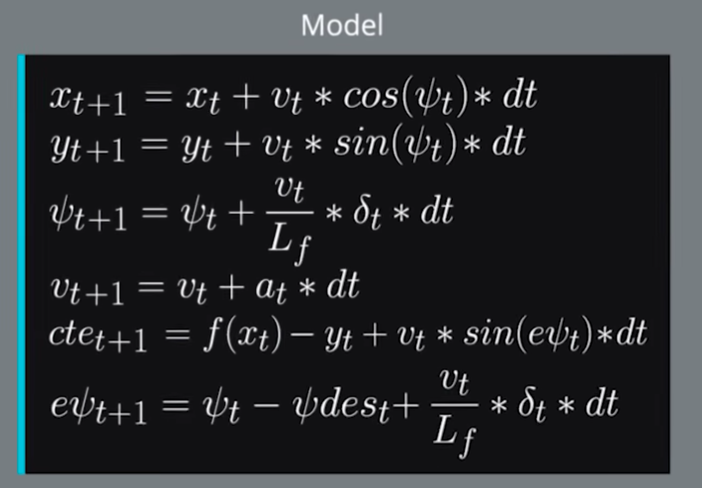

# MPC Project Writeup

In this project a MPC controller was implemented in order to steer a vehicle and make it follow the reference line. 

---

## MPC Algorithm

* Comparing to PID controller, the model predictive controller needs the model of vehicle and environment to predict the outcome of possible 
steering angle. A cost function can be design to represent the performance of the controller within certain time, so that it becomes a problem 
of optimization with constraints.

* Model: 
the following figure describes the motion model of the state vector of a vehicle unter control of actuator vectors.

  

* IPOPT was used to solve the nonlinear optimization problem.
  - All the state vectors of vehicle in the period of time N*dt is regarded as to optimised variables.
  - Cost function: in addition to the errors, large value of input vector or their derivatives must also be punished in the cost function in 
  order to achieve a smooth and stable behaviour.
  - Constaints: The motion model of vehicle act as constaints between state vectors and input vectors. 
  The first set of state vector was constrained by the initial value
  - Variable boundaries: all variables were limited by their corresponding physical plausible value.
* Latency: In order to deal with the delay of actuators, I simply predict the values of the state vector in the latency of 100 millisecond 
under the current actuation and feed the predicted state to the controller. The changes on speed, yaw angle and posion in x direction were taken into consideration while other changes were neglected.
* Reference line: the reference trajectory points were fitted by polyfit as a order 3 polynomial.

## Result
My optimal setting of dt and N are 0.08 second and 8. The following youtube link is my simulation result. After being able to drive the
 car along the track and satisfy all requirements, I exprimented with the two parameters by doubling and halving. 
 * Doubling dt brings worst result or even makes the controller unstable.
 * Halving dt with N unchanged also deteriorates the result especially at each turning, as the controller fails to predict it.
 * Halving dt and doubling N should theoretically improve the result, yet the performance still became worse. The reason may lies in the delay 
 created by the increased calculation.
 
Overall the MPC controller performs much better that my previous twiddled PID controller or behaviours clone controller.

  

